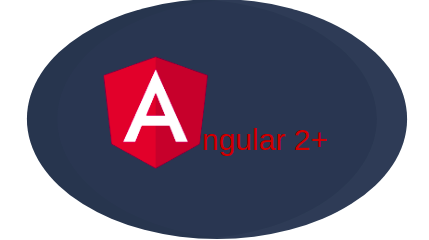
---
 What is Angular 2+?
---
It is a TypeScript framework used to build client-side applications with CSS, HTML, and TS. The primary building block of any Angular application are components with collections of code to execute specific behaviors.

Angular lets you use HTML as a template language and extend HTML’s syntax as you build components. Angular framework works by reading the HTML of a page and interpreting the attributes as directives to bind the page to a model based on standard TypeScript variables.

Key features of Angular
---
1. MVC architecture (Model-View-Controller): Separates program components into buckets of Model, View, and Controller to separate the presentation layer from the business logic.
2. Two-way Data Binding: Angular automatically synchronizes your HTML view with your code, allowing you to watch your view update to changes in real-time.
3. Routing Support: Easily build single-page applications (SPAs) that provide a desktop experience when navigating across views.
4. Dependency Injection: Allows code dependencies to be automatically injected with a dependency container, so no main() method is required.
5. Form Validation: Improve user experience in CRUD applications with Angular’s easy-to-implement form validation.

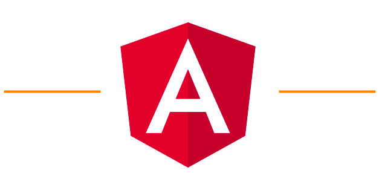
Angular
---
Angular is built with the opposite of React: maximize control at the cost of beginner-friendliness.

Once you master Angular, you have the tools to control and fine-tune every aspect of your app in a way you couldn’t with React.

Advantages
---
1. Angular is supported by Google, with detailed documentation and a large community. There are numerous high-quality resources provided to help you learn quicker.
2. Angular-language-service speeds up development with advanced coding features like autocomplete for external HTML template files.
3. Advanced MVC architecture for better division of responsibilities and code organization.
Supports test-driven development with instant code-to-view updates and tools for both end-to-end and unit testing.

Limitations
---
1. Harder to learn than React because Angular offers a variety of different structures like Injectables, Components, Pipes, Modules, and more. It takes time to learn the place for each of these structures rather than learning just components to React.
2. Slower performance by default because it works with the real DOM. Requires additional work to perform as fast as React, such as manual control of the rendering process.

Getting familiar with Angular elements
---
To understand Angular, you need to break down an application into its different elements and understand how they
interact.
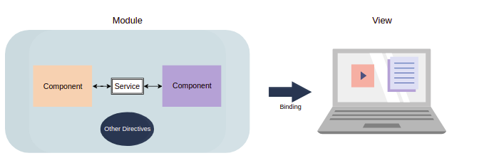
Angular apps have collections of alike components called Modules. Components are a special type of Directive that decides the behavior of a particular UI element. Components reference each other and back-end resources using connectors called Services.

Finally, all this code is automatically displayed in real-time from Model to View components using Data Binding.

Modules
---
Modules are containers of similar components, directives, and pipes that all relate to the same functionality. These modules can be imported and exported all at once, allowing for easy reuse across the app. Each component can only be a part of one module.

Think of Modules as a hybrid between classes and containers.
1. The bootstrap array contains the first component that will be initialized and rendered with the startup of the Angular application.
2. The declarations array contains a list of components, pipes, and directives that are defined in the module.
3. The imports array contains all the modules that our app will import from other libraries or Angular modules.
4. The exports array allows us to share components, pipes, or directives from this module to others.

Here’s an example of an Angular Module:
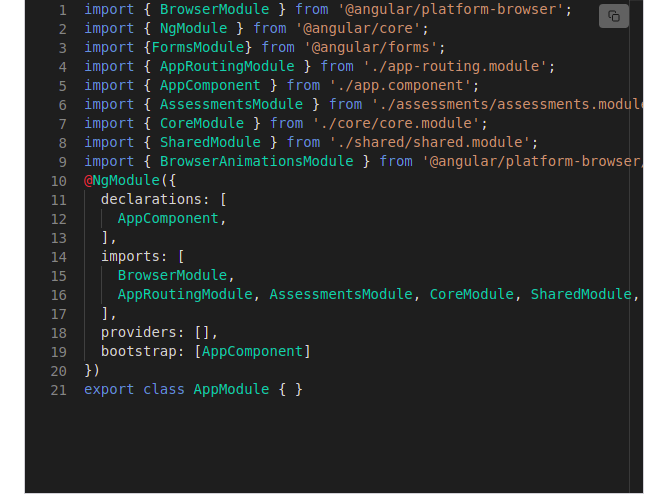

Components
---
Components are the most basic building block for any Angular application. Each component controls a section of the user interface called a view.

These components can have dynamic elements defined in the component’s class that respond to events like clicks or hovering over.

Components are updated, created, and destroyed as the user navigates through the application.
1. The selector sets the name of the component. Modules and directives use the name to reference this component.
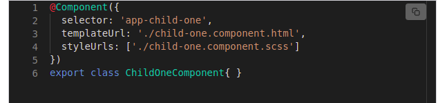
2. The templateUrl attribute declares which HTML file this component will reference for its behavior. You can also create an inline HTML template using template: followed by your code.
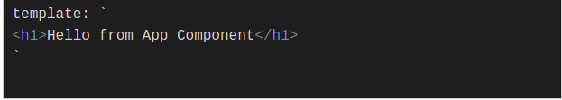
3. The stylesUrl attribute declares which CSS file this component will reference. As above, you can also inline your CSS style using:

 styles:['div { font-weight: 600; }']]

Here’s what a component looks like:

Directives
---
Directives extend the behavior of any HTML element. The behavior is often things like a change in layout or appearance. Apart from Components, there are two other main types of directives.

Attribute directives
---
These directives help us extend the behavior or appearance of the elements inside the template. The most commonly used attribute directive is NgStyle, which allows you to change the style of several elements at once.

Structural directives
---

Structural directives are the most widely used directive in Angular apps. These directives help us work on the layout of the data, for example looping through it, applying conditions on the data, etc. The convention for a structural directive uses an asterisk (*) before the directive name.

The commonly used structural directives are *ngFor and *ngIf.

1. *ngFor acts as a for loop that allows us to loop through an array:
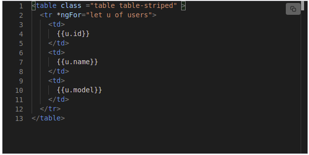
2. *ngIf acts as an if statement for conditional rendering of data:
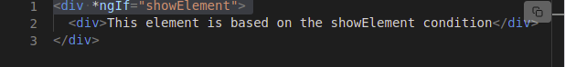

Services
---
Components need Services to fetch data to display. This data can be directly from the backend or another unrelated component. You can think of services as the couriers that connect components to their data source.

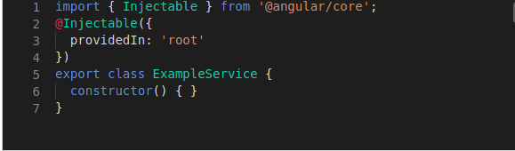

Services use Angular’s dependency injection system to track which classes (export class) depend on which data sources (providedIn).

Installing Angular
---
Before you get started, you’ll need to use the command line to install Angular. You’ll also need an updated version of Node.js and npm package manager.

First, install the Angular CLI by entering the following command into your terminal window:

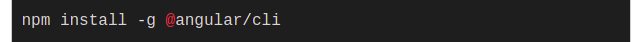

The CLI allows you to create projects, generate application/library code, and implement tasks like testing and deployment.
Next, you’ll need to create an Angular workspace and initial application.
In your terminal, enter the CLI command:

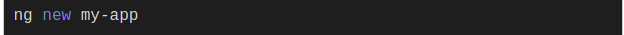
You’ll be prompted to enter information about the new app, but for now, simply accept the defaults. Finally, find the newly created workspace folder my-app and run these commands:

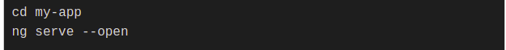

This will set up a responsive local app server and open it in your browser to localhost:4200. The webpage will provide several resources to continue learning or options like + New Component that will get you developing.
